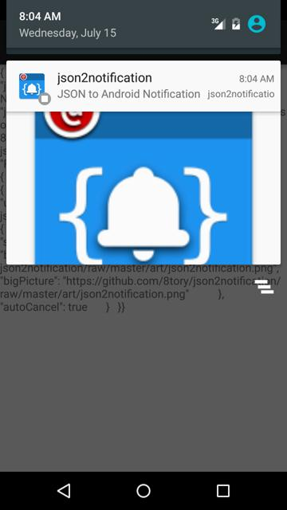

# json2notification

[](https://android-arsenal.com/details/1/2136)
[ ](https://bintray.com/8tory/maven/json2notification/_latestVersion)
[](https://jitpack.io/#8tory/json2notification)
[](https://jitpack.io/com/github/8tory/json2notification/f0c95a6cf4/javadoc/index.html)
[](https://travis-ci.org/8tory/json2notification)
[](https://gitter.im/8tory/json2notification?utm_source=badge&utm_medium=badge&utm_campaign=pr-badge&utm_content=badge)

[](https://github.com/changyuheng)
[](https://github.com/yongjhih)
Contributors..


[](https://appetize.io/app/bvrbydvtv3rex17t2ebn4wvcum)

Convert JSON to Android Notification. This is very useful for push notification (GCM).

## Usage

```java
Notification notification = Json2Notification.from(context).with(json).notification();
NotificationManager notificationManager = (NotificationManager) context.getSystemService(Context.NOTIFICATION_SERVICE);
notificationManager.notify(1, notification);
```

or

```java
Json2Notification.from(context).with(json).notify(1);
```

## Integration of Parse push notification

```java
public SimpleParsePushBroadcastReceiver extends ParsePushBroadcastReceiver {
    @Override public void onReceive(final Context context, Intent intent) {
        String json = intent.getStringExtra("com.parse.Data");

        Json2Notification.from(context).with(json).notify(1);
    }
}
```

## Installation

via jitpack:

```gradle
repositories {
    maven { url "https://jitpack.io" }
}

dependencies {
    compile 'com.github.8tory:json2notification:-SNAPSHOT'
}
```

via jcenter:

```gradle
repositories {
    jcenter()
}

dependencies {
    compile 'com.infstory:json2notification:1.0.1'
}
```

## Input json format

```json
{
    "android": {
        "notification": {
            "autoCancel": true,
            "bigPictureStyle": {
                "contentTitle": "json2notification",
                "summaryText": "JSON to Android Notification",
                "bigLargeIcon": "http://upload.wikimedia.org/wikipedia/en/b/bc/Wiki.png",
                "bigPicture": "http://upload.wikimedia.org/wikipedia/en/b/bc/Wiki.png"
            },
            "contentInfo": "json2notification.Json2Notification.from(context).with(json).notification();",
            "contentIntent": {
                "getActivity": true,
                "intent": {
                    "action": "android.intent.action.VIEW",
                    "uri": "https://play.google.com/store/apps/details?id=com.story8.android.gallery"
                }
            },
            "contentText": "JSON to Android Notification",
            "contentTitle": "json2notification",
            "deleteIntent": {
                "getActivity": true,
                "intent": {
                    "action": "android.intent.action.VIEW",
                    "uri": "https://play.google.com/store/apps/details?id=com.story8.android.gallery"
                }
            },
            "largeIcon": "http://upload.wikimedia.org/wikipedia/en/b/bc/Wiki.png",
            "smallIcon": "R.drawable.ic_launcher",
            "sound": "content://settings/system/notification_sound"
        }
    }
}
```

## Bonus: serialization

```java
Intent intent = new Intent(Intent.ACTION_MAIN);
intent.addCategory(Intent.CATEGORY_HOME);
intent.setFlags(Intent.FLAG_ACTIVITY_NEW_TASK);

new NotificationCompat.Builder(context)
    .setContentTitle("Hello World!")
    .setContentText("Hello World!")
    .setContentIntent(PendingIntent.getActivity(context, 0, intent, PendingIntent.FLAG_UPDATE_CURRENT))
    .build();

String json = Json2Notification.from(context).with(notifiction).serialize();
```

## Live Demo

* status bar: https://appetize.io/app/bvrbydvtv3rex17t2ebn4wvcum

## LICENSE

```
Copyright 2015 8tory, Inc.

Licensed under the Apache License, Version 2.0 (the "License");
you may not use this file except in compliance with the License.
You may obtain a copy of the License at

   http://www.apache.org/licenses/LICENSE-2.0

Unless required by applicable law or agreed to in writing, software
distributed under the License is distributed on an "AS IS" BASIS,
WITHOUT WARRANTIES OR CONDITIONS OF ANY KIND, either express or implied.
See the License for the specific language governing permissions and
limitations under the License.
```
